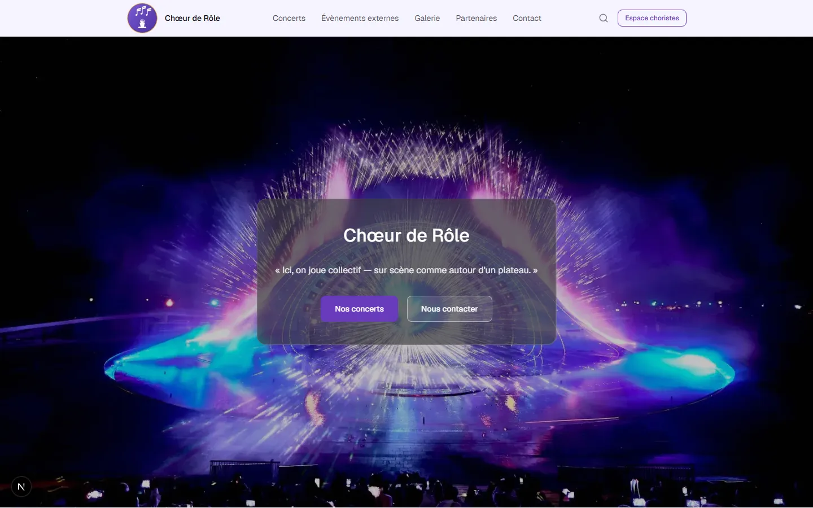
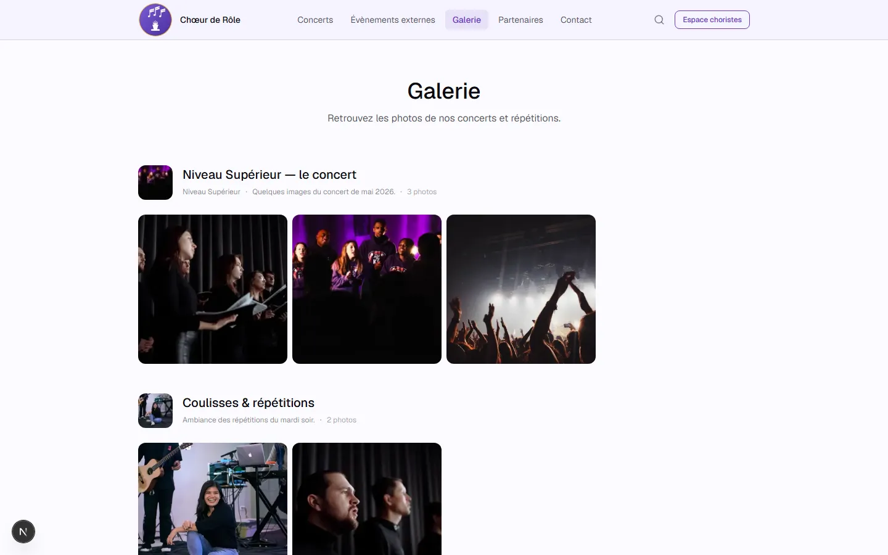
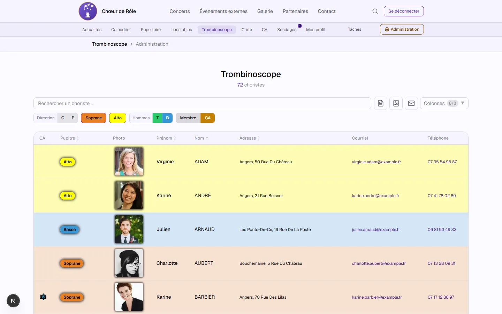
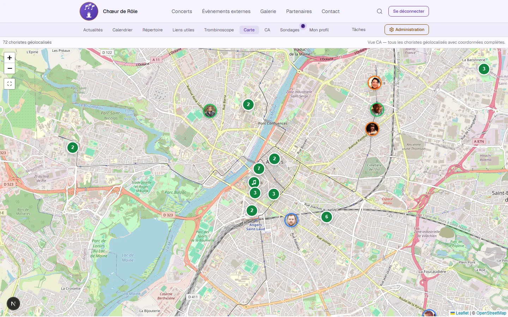

# Chœur de Rôle

    

Site vitrine et espace membres d'une chorale **fictive** à Angers, mêlant chant choral et jeux de société. Projet de démonstration portfolio : toutes les données (choristes, concerts, actualités...) sont inventées, mais l'application est complète et fonctionnelle de bout en bout — site public, espace privé des choristes et back-office d'administration.



## Fonctionnalités

### Site public

- **Accueil** entièrement éditable par blocs de contenu (héro, histoire, raison d'être, présentation de la direction artistique et du pianiste)
- **Concerts** à venir / passés, avec affiche et détail par représentation
- **Galerie** photos (albums) et vidéos (playlist YouTube synchronisée)
- **Partenaires**, **événements externes**, formulaire de **contact**

|                                                    |                                                          |
| -------------------------------------------------- | -------------------------------------------------------- |
|      |  |
|  | Répertoire, sondages, carte, tâches de bureau...        |

### Espace choristes

Accès réservé aux membres connectés (authentification Supabase, double facteur) :

- **Trombinoscope** filtrable par pupitre, avec export et respect de la visibilité choisie par chaque choriste (email/téléphone/adresse)
- **Carte** des choristes géolocalisés
- **Répertoire** : partitions, paroles et pistes audio par pupitre
- Actualités, calendrier des répétitions, sondages, comptes-rendus de bureau, liens utiles
- Espace **bureau** : tâches de préparation des concerts, assignées aux membres élus

### Administration

Back-office pour gérer l'ensemble du contenu : membres, saisons et pupitres, concerts, galerie, partenaires, calendrier, sondages, répertoire.

## Stack technique

- **Framework** : Next.js (App Router) + TypeScript
- **Style** : Tailwind CSS
- **Backend** : Supabase (Auth, Postgres, Storage, RLS)
- **Fichiers** : Cloudflare R2 (répertoire, images), Supabase Storage en secours
- **Carte** : Leaflet
- **Divers** : Tiptap (éditeur riche), jsPDF, JSZip, YouTube Data API v3

## Installation

```bash
npm install
```

Copier `.env.local.example` vers `.env.local` et renseigner les variables.

```bash
npm run dev:e2e   # démarre Supabase local (Docker) puis le serveur Next.js
```

Ouvrir [http://localhost:3000](http://localhost:3000).

## Scripts disponibles

| Commande                | Description                                     |
| ------------------------ | ------------------------------------------------ |
| `npm run dev`            | Serveur de développement                        |
| `npm run dev:e2e`        | Démarre Supabase local puis le serveur          |
| `npm run build` / `start` | Build et lancement en production               |
| `npm run lint` / `type-check` | Qualité de code                            |
| `npm run test` / `test:watch` | Tests unitaires (Vitest)                   |
| `npm run test:e2e`       | Tests end-to-end (Playwright)                   |
| `npm run db:reset`       | Réinitialise la DB locale (migrations + comptes de test) |

## Structure du projet

```
src/
├── app/                    → Routes Next.js (App Router)
├── components/
│   ├── features/           → Un dossier par domaine métier (concerts, galerie, trombinoscope...)
│   ├── layout/              → Header, Footer, navigation
│   └── ui/                  → Composants génériques réutilisables
├── lib/                     → Auth, Supabase clients, utilitaires transverses
└── types/                   → Types générés et types partagés

supabase/
└── migrations/              → Schéma et données de démonstration, appliquées dans l'ordre
```

## Tests

```bash
npm run test          # Unitaires (Vitest)
npm run test:e2e      # End-to-end (Playwright, nécessite Supabase local)
```
